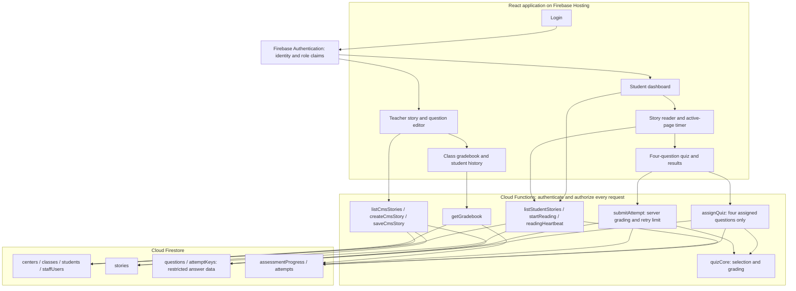

# Current application architecture

[Open the rendered diagram](architecture.svg) · [Mermaid source](architecture.mmd)

Firebase Hosting serves the React app. Firebase Authentication identifies users; server checks enforce student membership and staff scope. Firestore rules independently restrict direct browser access. Cloud Functions use the Admin SDK after authorization.

The browser displays passages and assigned questions. `assignQuiz` chooses four questions, preferring unseen questions and reusing a smaller bank when necessary. It returns no answer key. `submitAttempt` computes grades on the server and enforces three total attempts. Reading progress is credited through server heartbeats while the reader is active.

Teachers save stories and question banks through authorized functions. The gradebook combines class rosters with submitted attempts to show missing work, highest scores, and student history. There is no recording or speech-processing service in this application.

Historical source is preserved only in `archive/legacy-source.zip`, outside the active source tree. Historical cloud resources are not diagrammed as active dependencies. The diagram covers the current user flows; retained review and event-logging callables are documented in the implementation guide.

## Refresh GitDiagram

Open [this repository in GitDiagram](https://gitdiagram.com/pgunhal/kannada-reading-evaluation), connect the repository if prompted, and select **Regenerate** after the latest commit appears on GitHub. If it asks for guidance, use: “Diagram the current React/Firebase reading and quiz application. Exclude archive/legacy-source.zip and historical screenshots. Follow the Repository scope section in README.md.”
