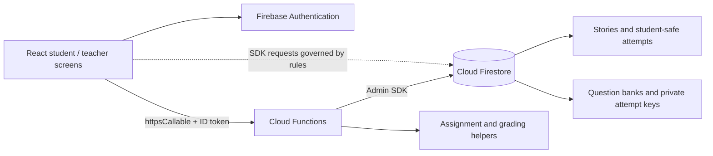
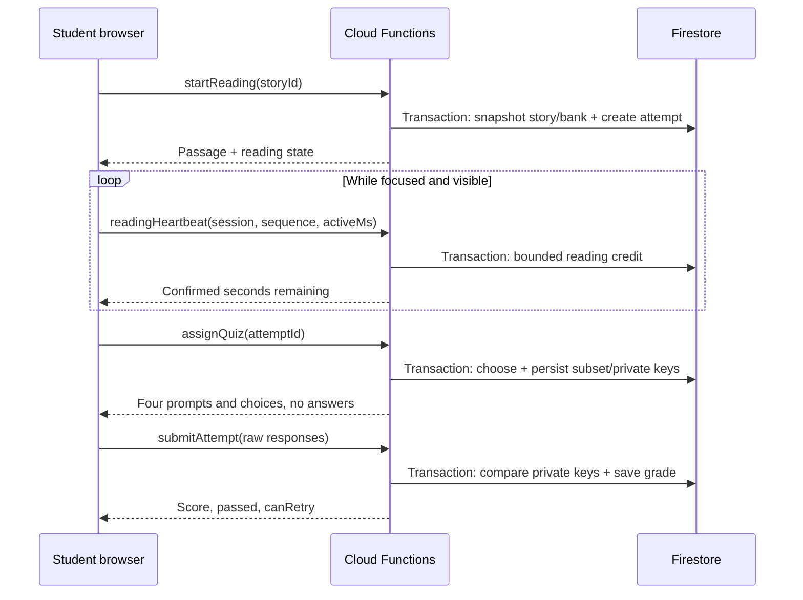

# Kannada Kali — implementation guide

Code walkthrough and handoff, 10 September 2026. This describes the current repository, rather than the original proposed architecture. For a short walkthrough and credentials, see [assessment.md](assessment.md). For the live-project handoff, see [firebase-live-setup.md](firebase-live-setup.md). For actual browser captures, see [the screenshot gallery](screenshots/index.html).

## 1. What is built

The new application has two connected experiences:

- **Students:** Dashboard → read a Kannada story → answer four choice questions → see a server-calculated result → retry after a failed result, up to three attempts total.
- **Teachers:** Story studio for authoring and publication; per-story progress; a roster-based Gradebook showing missing work and highest scores; individual student attempt history.

English is used for navigation, buttons, field labels and instructions. Story titles, passages, question prompts and authored answer choices are Kannada. True/false controls are English. Children never type an answer, including for “choose the missing word” questions.

Four demo stories each have twelve authored questions. This is real emulator-backed functionality, not an array of browser-only mock screens: publication, saved edits, reading progress, assignments and grades go through Firebase. The demo roster has four students; only Demo student has a provisioned login. Ananya, Kiran and Meera illustrate missing work.

The earlier audio-reading code is preserved in `archive/legacy-source.zip`, outside the active source tree; its application routes have been removed. It has a different scoring path and collections. Its browser-calculated audio scores do not become quiz grades.

## 2. Runtime architecture and source map



| Area | Implementation |
|---|---|
| Frontend | React 19, JavaScript/JSX, React Router 7, Create React App / react-scripts 5 |
| Firebase browser SDK | Firebase 11; Auth, Firestore and callable Functions |
| Server | CommonJS JavaScript; firebase-functions 4 `https.onCall`, firebase-admin 11; package requests Node 22 |
| Styling | Scoped CSS, native HTML controls, inline SVG book icon, CSS illustrations |
| Data store | Cloud Firestore documents and transactions |
| Local services | CRA :3000; Auth :9099; Firestore :8080; Functions :5001 |
| Tests | Node test runner and Firebase rules testing; React Testing Library/Jest; external Playwright browser checks |

Key source files, relative to the repository root:

| File | Responsibility |
|---|---|
| `client/src/App.js` | Auth lifecycle, claims loading and routes |
| `client/src/firebaseConfig.js` | Firebase initialization and emulator switches |
| `client/src/components/assessment/AssessmentLayout.jsx` | Shared brand header, navigation and sign-out |
| `AssessmentHome.jsx` in that folder | Dashboard, filters, cards and completion count |
| `Assessment.jsx` | Reading, quiz and result screen state; callable requests; answer draft |
| `useActiveReading.js` | Focus-aware collection of reading intervals |
| `useReadingProtection.js` | Temporary copy/paste/context-menu event listeners |
| `StoryStudio.jsx` | Passage/bank editing, draft/publication and per-story progress |
| `Gradebook.jsx` | Whole-class results and student-history table |
| `assessment.css` | Brand colors, status colors, responsive layout and radio cards |
| `functions/index.js` | Admin SDK initialization and function exports; legacy `setWeekStory` |
| `functions/quiz.js` | Callable handlers, authorization, transactions and snapshots |
| `functions/quizCore.js` | Validation, random assignment, response grading and old cloze normalization |
| `functions/gradebook.js` | Roster join, staff/class scoping, missing work and best-score aggregation |
| `functions/scripts/demoStories.js` | Four Kannada passages and their twelve-question banks |
| `functions/scripts/seedQuizEmulator.js` | Local account claims, class/center/staff/roster and demo story data |
| `firestore.rules`, `firestore.indexes.json` | Direct SDK access policy and composite index definitions |
| `firebase.json`, `.firebaserc` | Emulator/deployment configuration and default project alias |

The quiz/CMS does not call the Express server under `backend/`, the Python/DTW experiments, Firebase Storage, or a text-generation API. Those files belong to earlier audio work. There is no AI question generation or content ingestion pipeline in this implementation.

## 3. Routes and frontend state

| Route | Screen / behavior |
|---|---|
| `/` | Login when signed out; student Dashboard for a student claim; staff redirected to Story studio; new Dashboard with class-assignment message for an account without CMS membership |
| `/app` | Student Dashboard, or login |
| `/app/stories/:storyId` | Reading, quiz and result views share one route |
| `/admin/login` | Teacher/admin email-password login |
| `/admin/stories` | Story studio with Passage, Questions and Student progress tabs |
| `/admin/gradebook` | Gradebook and selected student's history |
| `/admin/reviews` | Redirects to Gradebook; no current review screen |
| `/signup` | Legacy account registration, not CMS student provisioning |
| `/admin/dashboard` | Redirect to current Story studio |

`App.js` subscribes to `onAuthStateChanged`, then obtains `getIdTokenResult()` for claims. A revision counter prevents a slow earlier auth callback from replacing newer login/logout state. It renders a loading state until this completes. Sign-out calls Firebase Auth's `signOut`.

Route checks mostly require a signed-in user; they are not the security boundary. Opening a staff URL as a student can reach the component, but its backend request is rejected. Cloud Functions and Firestore rules determine access.

On the Dashboard, `listStudentStories` is called on mount and on explicit retry after an error. Cards are sorted by week. Filters are local filtering of the safe metadata already returned. Returning to the Dashboard remounts it and reloads results. It is not a Firestore realtime listener.

In the assessment component, `screen` is local React state: `reading`, `quiz`, or `result`. The story ID keys the component so navigation between stories resets its local state. Opening a story immediately calls `startReading`; its response contains the passage. The page does not hide the passage until the timer is complete.

The quiz renders one assigned question at a time. Selecting a card updates `answers[questionId]`. The answer draft is written to `sessionStorage` under `quiz-answers:<attemptId>` and removed after a successful submission. Refreshing preserves the draft in that browser session, but it does not persist an unfinished answer selection to Firestore. Revisiting the reading view does not discard selected answers. The current question index itself is not restored after a reload.

## 4. Firebase Authentication and authorization

### Authentication versus membership

Firebase Authentication verifies email/password and issues the signed ID token. Application membership comes from custom claims and Firestore records.

A student token has this shape:

```json
{
  "role": "student",
  "studentId": "demo-student",
  "classId": "demo-class",
  "centerId": "demo-center"
}
```

The demo teacher token has `role: "volunteer"` and `centerIds: ["demo-center"]`. The corresponding `staffUsers/demo-teacher` record contains the current role and center IDs, while `classes/demo-class.teacherUids` includes the teacher's Auth UID.

`studentId` is the application student identifier. `authUid` is the Firebase Authentication account identifier. Attempts save both; student ownership checks require both to match. Guessing an attempt document ID does not grant access.

The browser calls `httpsCallable(functions, name)(payload)`. The Firebase SDK attaches the current auth credential; the callable receives verified auth information in `context.auth`. The server does not accept a student ID or role from the submitted payload as proof of identity.

### Staff scope

The new server handlers read `staffUsers/{authUid}` rather than trusting a role field from a request:

- Admin: access across centers/classes for these handlers.
- Coordinator: access within assigned centers.
- Volunteer: authoring access to stories whose centers are within the volunteer's center access; attempt/history access additionally requires membership in the class's `teacherUids`.
- Multi-center story editing requires the non-admin to cover every center on the story.

The Gradebook independently checks the current staff record, selects authorized classes, and reads students/attempts for those classes. It also checks each record's center against the class center before returning it.

Custom claims are set with the Admin SDK by the emulator seed, not editable by students. Claims are cached in ID tokens, so a signed-in session may need a token refresh or sign-out/sign-in after a claims change. CMS provisioning requires both suitable claims and the relevant Firestore membership records. The signup form creates an Auth account and a `users` profile only; it does not assign CMS claims or class membership.

## 5. Firestore model

Paths below are collection/document paths. Auth users live in Firebase Authentication, not in these collections.

| Path | Important fields | Purpose |
|---|---|---|
| `centers/{centerId}` | `name` | Teaching center |
| `classes/{classId}` | `name`, `centerId`, `teacherUids[]` | Class and teacher assignment |
| `staffUsers/{authUid}` | `role`, `centerIds[]`, `displayName` | Current staff authorization record |
| `students/{studentId}` | `displayName` or `name`, `classId`, `centerId` | Gradebook roster, including students with zero attempts |
| `stories/{storyId}` | `title`, `body`, `week`, `status`, `centerIds[]`, `classIds[]`, `questionCount`, `bankSize`, optional `threshold`, `theme`, `version` | Authored content and assignment scope |
| `questions/{questionId}` | `storyId`, `type`, `difficulty`, `prompt`, `options[]`, `correctAnswer`, `source` | Author-only question bank |
| `assessmentProgress/{pairHash}` | `attemptId`, `attemptNumber`, `studentId`, `storyId` | Server-only pointer to current attempt |
| `attempts/{attemptId}` | Ownership, story snapshot, reading state, safe assigned questions, raw submitted answers, grade, timestamps | Durable progress and audit history |
| `attemptKeys/{attemptId}` | Before assignment: `bank`, `usedQuestionIds`; afterward: `questions` including correct answers | Server-only bank/answer snapshot |
| `storyVersions/{storyId}/versions/{version}` | Reserved by rules | No version-history authoring UI or writer is implemented |

A story is assigned when it is published, contains the student's center ID, and either has an empty `classIds` array or includes that student's class. An empty class list means all classes in the listed centers. Drafts are omitted from the student Dashboard.

An attempt initially contains `studentId`, `authUid`, `centerId`, `classId`, `storyId`, `week`, `storyVersion`, a snapshot of the story title/body/subtitle/theme, `attemptNumber`, `readingActiveMs`, `readingStartedAt`, `minSeconds`, `status`, `threshold`, `questionCount`, and `pasteAttempted`.

Later it receives session/sequence heartbeat fields, assigned question IDs, safe question objects, `readingCompletedAt`, graded `answers`, `score`, `passed`, `needsReview`, and `submittedAt`. Legacy reviewed attempts can also contain reviewer identity, note and timestamp.

### Attempt IDs and immutability

The first attempt ID is the SHA-256 hex digest of `JSON.stringify([studentId, storyId])`. Attempts two and three append `-2` and `-3`. This creates a stable student/story attempt namespace; it is not an authorization mechanism or an encryption scheme.

A retry creates a new attempt document and updates the progress pointer. It does not overwrite the old attempt. A passage and bank snapshot are taken when an attempt starts, so later teacher edits do not change that in-flight attempt's story or answer key. Existing graded history also stays intact.

Resuming an existing attempt returns its snapshot before checking the current publication state. Consequently, unpublishing removes a story from the shelf and blocks new attempts, but it does not revoke an already-created attempt's direct-link access. This is the current behavior, useful to know when managing publication.

## 6. Callable API inventory

All quiz callables require an object payload. IDs are checked for a nonempty string of at most 200 characters without `/`. Failures use Firebase `HttpsError` codes such as `unauthenticated`, `permission-denied`, `invalid-argument`, and `failed-precondition`.

| Callable | Input | Main output / responsibility |
|---|---|---|
| `listStudentStories` | `{}` | Scoped published story metadata and current attempt status; no question bank |
| `startReading` | `{storyId, retryFromAttemptId?}` | Creates/resumes an attempt; returns passage and safe progress state |
| `readingHeartbeat` | `{attemptId, sessionId, sequence, activeMs}` | Credits a bounded active interval and returns confirmed remaining time |
| `assignQuiz` | `{attemptId}` | Gates on credited reading; selects/persists and returns only assigned safe questions |
| `submitAttempt` | `{attemptId, answers:[{questionId,response}]}` | Server grades; returns score/pass/review and retry eligibility |
| `logPasteAttempt` | `{attemptId}` | Sets a one-way paste telemetry flag; no grade changes |
| `listCmsStories` | `{}` | Staff-authorized story bodies, full question banks, and scoped per-story attempt summaries |
| `createCmsStory` | `{}` | Creates a draft in the teacher's first assigned center; returns `storyId` |
| `saveCmsStory` | `{storyId,title,body,status,questions?}` | Validates and atomically saves story and bank |
| `getGradebook` | `{}` | Authorized classes, published story columns, roster rows, best results, missing counts and histories |
| `getAttemptReview` | `{attemptId}` | Legacy staff-only private review detail |
| `reviewAttempt` | `{attemptId,note,decisions:[{questionId,correct}]}` | Legacy pending-cloze review and grade recomputation |
| `setWeekStory` (retained cloud resource only) | `{week,storyName}` | Historical settings; no longer exported by current source |

### Typical request sequence



## 7. Active reading timer

The reading gate is `max(20, min(180, ceil(whitespaceWordCount / 2)))` seconds. It estimates about two words per second and caps at three minutes. The Dashboard's “min read” is a separate rounded estimate at 120 words/minute; it is not the server gate. The timer measures reading only; there is no quiz countdown or submission deadline.

The hook runs only on the reading screen while the attempt is still in `reading` status:

1. Require `document.visibilityState === "visible"` and `document.hasFocus()`.
2. Start a new UUID session and send sequence `0`, which opens the session without earning time.
3. Poll every 250 ms using `performance.now()` and accumulate short active intervals.
4. Ignore individual scheduling gaps of 1,500 ms or more, such as device sleep/suspension.
5. Flush approximately every 1,900 ms, or on blur/hide/unmount. Each sent interval is at most 3,000 ms.
6. Serialize outgoing requests through a promise chain so this window's heartbeats stay ordered.
7. Display only server-confirmed remaining seconds and enable the quiz only after the server reports zero.

The server transaction credits `min(reportedActiveMs, elapsedServerMs, 3000)` and caps the running total at the gate. The current session ID must match. Replayed or older sequence numbers cannot add duplicate credit. A new session does not credit the period spent away. Simultaneous tabs cannot accumulate time independently against the same current session.

Time away, a changed wall clock, or a page refresh does not complete reading. A lost request can lose a small amount of unconfirmed reading time, and slow/offline requests can make the counter advance more slowly. There is no durable offline heartbeat queue.

Visibility is still a browser-reported signal. Someone deliberately scripting valid heartbeats can imitate ongoing activity. The implementation prevents naive elapsed-wall-time and duplicate-credit shortcuts; it does not prove human attention or prevent sophisticated cheating.

## 8. Assignment, grading and retries

### Bank validation and assignment

Question types are `mcq`, `true_false`, and `cloze`; difficulty is `easy`, `medium`, or `hard`. MCQ and current cloze questions require four distinct, nonempty options and a matching correct answer. True/false keys must be the strings `true` or `false`. Legacy cloze without choices is filtered out when starting new attempts.

The demo uses four questions per attempt. The lower-level assignment helper supports counts three through five, but the current UI and CMS publishing minimum are designed around four; a different count is not an exposed setting.

The server uses cryptographic `randomInt` with Fisher–Yates shuffling. It prefers question IDs not assigned in previous attempts. It selects difficulty coverage, using a nearby difficulty if a bucket is empty; unseen questions take priority over strict difficulty coverage. Remaining slots are filled from the remaining bank. Both question order and choice order are shuffled and then saved once.

With twelve stable question IDs, the three four-question assignments are disjoint. With a smaller bank, used questions become eligible when unseen questions run out. An individual attempt still cannot contain duplicate IDs. “Distinct” is based on IDs, not semantic similarity of prompts: teachers must avoid authoring duplicates under different IDs. Deleting/recreating a question makes a new ID, which assignment treats as new.

`publicQuestion` is an allowlist: only `id`, `type`, `prompt`, and `options` are sent to students. Neither `correctAnswer` nor difficulty nor the full bank is returned by assignment. The bank read happens with the Admin SDK inside the function.

### Server grading

`submitAttempt` requires exactly one string response for each assigned ID, no duplicates/unknown IDs, and no response longer than 1,000 characters. It loads the attempt's private answer keys. Browser fields such as `score`, `passed`, or `correct` are not used.

Current choice responses are graded by equality with the saved answer string. Score is `correctCount / questionCount`. The default pass threshold is 0.70, snapshotted on the attempt. For four questions, 3/4 (75%) passes and 2/4 (50%) fails. A duplicate submission returns the stored result rather than grading a replacement set of responses.

### Retry transaction

A retry sends the ID of the attempt the user is retrying. The transaction requires it to be submitted, failed, not pending review, and below attempt three. It collects previously assigned IDs, takes a fresh snapshot for the next attempt, and advances the pointer. Two concurrent retry requests converge on the same new attempt rather than consuming two attempts. A stale replay resumes the current attempt. Passing prevents another attempt even if fewer than three were used.

Retries include a new active reading period. A student who has passed or used all attempts can still reread the stored story.

### Historical typed cloze

Only old typed-cloze attempts use NFC normalization, removal of whitespace, and a Unicode-code-point edit distance of at most one. A near miss gets `correct: null`, `needsReview: true`, and no final score until staff decide. Kannada marks are not broadly stripped. Server review functions still exist for such data, but the current UI has no review queue because every new question is choice-based.

## 9. Teacher authoring

Story studio loads authorized stories with their full banks. Selecting a story creates an editable local copy. Passage and Question edits mark it dirty; successful save refreshes the authoritative server state. Switching stories or creating a draft prompts before discarding unsaved edits. There is no general browser-close/navigation autosave guarantee.

Creation makes a draft with a Kannada placeholder title and empty body/bank. Saving requires a nonempty title (maximum 200 characters), nonempty body (maximum 20,000 characters), valid publication status and valid provided questions. Drafts may have fewer than four questions, but any question present must be valid; a half-filled new question is not saved as-is. Publishing requires at least four valid questions.

Saving uses a Firestore transaction. Existing IDs belonging to the same story are preserved. New IDs and IDs belonging to another story are replaced with fresh server-generated IDs, so a malicious payload cannot overwrite another story's questions. Removed questions are deleted from the authored bank. Existing attempt snapshots are unaffected.

The editor fieldset is disabled while a save is running. Progress refresh fetches server state but preserves unsaved passage/question changes. Current saves do not use an editor revision/conflict token: two teachers editing simultaneously can overwrite each other's authored changes through last-save-wins behavior. The stored `updatedBy`/`updatedAt` is not a full revision-history system.

## 10. Gradebook semantics

The Gradebook is roster-based, not just an aggregation of students who submitted:

1. Resolve classes visible to the current staff member.
2. Load roster students and attempts for each class and verify center consistency.
3. Include historical attempt owners even if no matching roster entry exists, using their ID as the display name.
4. Build columns from published stories assigned to at least one visible class.
5. For each student/story, compute the maximum non-pending submitted numeric score.
6. Mark missing when there is no submitted attempt. A reading or unfinished quiz attempt still counts as missing; a pending historical review counts as submitted/pending.
7. Return the missing count and all scoped attempt summaries for the student's detail view.

A cell is a highest score, **Missing**, **Pending**, or an em dash for a story not assigned to that student's class. “Missing” does not mean overdue: there are no due dates. A submitted failing score is not missing. Unpublished stories are absent from current missing counts and columns, while their existing attempts remain in history.

Clicking a student shows story snapshot title, attempt number, status, score and submission date/time. History sorts newest reading start first. Dates are formatted in the viewer's local timezone. This is the complete scoped attempt list, not an answer-by-answer drilldown. It does not expose the answer bank or PIN/hash fields.

For the demo, the function returns all histories with the initial gradebook response; selecting a student is local state, and Refresh re-fetches. Class filtering is client-side within the already authorized response. This is simple for a small class but not paginated or optimized for a large deployment. The gradebook color convention assumes the current 70% threshold.

## 11. Security rules and actual boundaries

Firestore rules govern direct browser SDK reads/writes. Admin SDK operations in Cloud Functions bypass those rules, so handler authorization and payload validation are essential, not optional duplication.

| Collection | Direct student access | Direct staff access / notes |
|---|---|---|
| `questions` | Denied | Authorized story staff can read; writes through functions only |
| `attemptKeys` | Denied | Denied to all client SDKs; only authorized functions return legacy review keys |
| `assessmentProgress` | Denied | Denied by catch-all; server-only pointer |
| `attempts` | Read own student ID + Auth UID; all writes denied | Current-record staff reads, with volunteer class assignment; writes denied |
| `students` | Denied | Current-record staff reads, with volunteer class assignment; client writes denied |
| `staffUsers` | Signed-in owner can read their own record | Admin can read; client writes denied |
| `stories` | Published assigned stories | Story-scoped staff reads; writes through functions only; legacy read compatibility |
| `classes` | Read own class | Center staff read; client writes denied |
| `centers` | Public read | Admin write |

Material limits of the current policy:

- **Roster/attempt reads now check current membership.** Direct reads consult `staffUsers` and, for volunteers, `classes.teacherUids`, so a stale volunteer token alone is insufficient. Coordinators remain center-scoped and admins can access all classes.
- **Authored writes now require functions.** Direct browser writes to `stories` and `questions` are denied even for teachers, keeping validation in the callable save path.
- **Student-safe does not mean confidential passage text.** Students can read their assigned story documents, and their own attempt documents contain safe questions and, after submission, graded responses. The complete bank and explicit answer keys remain private, but post-submission correctness is present in the student's own attempt record.
- **Legacy compatibility remains.** Authenticated users can read legacy stories without `status`. Old `users`, `scores` and `adminSettings` permissions coexist with CMS rules. Legacy audio score writes are intentionally separate and client-writable.
- **No App Check/rate-limiting integration is implemented.** Identity and authorization checks exist, but there is no extra app-attestation layer here.

Copy/paste prevention is a usability deterrent: listeners cancel copy, cut, paste, context menu and drag events only while reading/quiz views are mounted. Those listeners are document-scoped while active and are removed on result/unmount. CSS prevents ordinary selection in passage/quiz containers. It does not render Kannada as an image, block developer tools, prevent screenshots/OCR, or make accessible DOM text secret. Paste telemetry does not alter a score.

## 12. Styling and accessibility

`assessment.css` scopes the new app styles so the older global login/audio CSS does not distort its layout. The original source pigments are `--kk-yellow: #f3e40eb8` and `--kk-red: #a10303d5`; both contain alpha, so the visible color depends on the background. Card fills sit over white. `--kk-green: #267347` is used for completed status.

Dashboard status drives the badge and illustration background together: New is yellow, In progress/retry/attempt-limit is red, Completed is green. Text labels accompany color. Header accents, primary buttons and selection states reuse the brand palette. Book artwork is inline SVG plus CSS shapes, with no image service.

Answer cards wrap real radio inputs, visually hidden while still keyboard-focusable. Labels provide large click/touch targets; native arrow-key behavior remains. `fieldset`/`legend`, focus outlines, `lang="kn"`, progress labels, and alert/status regions support accessibility. Kannada uses Noto Sans Kannada loaded through the HTML font link, with font fallbacks. No formal full accessibility audit has been completed.

The story grid is two columns on desktop and one on small screens. Teacher navigation remains available on mobile. Gradebook tables scroll horizontally inside their container, preserving complete columns without making the whole page overflow.

## 13. Local setup, persistence and troubleshooting

The frontend's `REACT_APP_USE_FIREBASE_EMULATORS=true` selects project `demo-kkali-quiz`, a dummy API key and localhost Auth/Firestore/Functions. Without that flag, `firebaseConfig.js` requires the live project web configuration in `REACT_APP_FIREBASE_*` environment variables; there is no embedded fallback project. `.firebaserc` also defaults to that real project, so local commands below explicitly select the demo project.

Use the Node version specified by `functions/package.json` (22), Firebase CLI, and a Java runtime capable of starting the Firestore emulator.

```sh
# Repository root, first terminal
npm --prefix functions ci
firebase emulators:start --only auth,firestore,functions --project demo-kkali-quiz
```

```sh
# Repository root, second terminal
FIRESTORE_EMULATOR_HOST=127.0.0.1:8080 \
FIREBASE_AUTH_EMULATOR_HOST=127.0.0.1:9099 \
node functions/scripts/seedQuizEmulator.js

npm --prefix client ci
REACT_APP_USE_FIREBASE_EMULATORS=true BROWSER=none npm --prefix client start
```

| Role | Email | Password |
|---|---|---|
| Student | `student@example.test` | `local-demo-only` |
| Teacher | `teacher@example.test` | `local-demo-only` |

The seed requires both emulator host variables and targets the demo project. It provisions claims, class/center/staff records, four roster entries, and four twelve-question banks. It preserves attempts but **replaces the four seeded story bodies and banks**. Do not reseed just to refresh the UI after author edits.

Emulator data is temporary unless explicitly exported/imported. For persistence, start emulators with an export location, then use it on later runs:

```sh
firebase emulators:start --only auth,firestore,functions \
  --project demo-kkali-quiz --export-on-exit=./.emulator-data

# Later, after an export exists:
firebase emulators:start --only auth,firestore,functions \
  --project demo-kkali-quiz --import=./.emulator-data \
  --export-on-exit=./.emulator-data
```

Do not commit emulator exports containing account/student data. The Emulator UI is disabled in the current config. The Auth emulator's injected warning banner is suppressed in the frontend to prevent it covering the mobile interface; this does not change which backend is used.

Firebase Storage is initialized for legacy code but is **not** connected to a Storage emulator by the current flag. Emulator configuration now uses a demo bucket identifier instead of inheriting a live bucket. The CMS screenshots/flow do not use it. Do not assume every legacy Firebase service is emulated solely because Auth/Firestore/Functions are.

Common symptoms:

| Symptom | Explanation / check |
|---|---|
| `auth/user-not-found` | Fresh Auth emulator has not been seeded, or browser is connected to a different Firebase project |
| Old audio app after login | Check the URL and refresh cached assets; current routes never render the historical recording dashboard |
| Old UI on :3000 | Confirm the process serving that port is this repository's client and was started with the emulator environment flag |
| Timer paused | The reading screen/window must be focused and visible; activity on another application does not count |
| Timer save error | Check Functions/Auth/Firestore are running and connected; return/reopen to establish a new reading session |
| New story absent | Confirm Published, valid bank, center/class scope, then reopen the student Dashboard |
| Missing new grade | Gradebook is request/refresh based, not realtime; click Refresh |
| Staff permission denied | Check `staffUsers`, center IDs, class `teacherUids`, and current token |
| Switching roles changes another tab | Firebase Auth state is shared in one browser profile; use separate profiles/private contexts |

## 14. Indexes, deployment state and scaling limits

Configured composite indexes are `stories(status ASC, centerIds ARRAY_CONTAINS)` and `attempts(centerId ASC, needsReview ASC)`. The latter supports the retained legacy review query pattern. Gradebook queries currently filter each roster/attempt collection by class ID using ordinary single-field indexing.

Production deployment was completed on 24 September 2026 at https://kkalisite-4fc4e.web.app. `firebase.json` configures Functions, Firestore and Firebase Hosting with an SPA rewrite. A built frontend is produced in `client/build`; the Hosting predeploy hook validates live configuration and builds it. Project settings are configured for this site; the live setup guide documents subsequent deployments and account provisioning. The current callable syntax uses the v1 API, without a custom region setting in this code.

Current operational limits include one private Firestore document holding a bank snapshot, transaction limits when replacing large banks, heartbeat writes roughly every two seconds per active reader, per-story reads for the student shelf, and whole-authorized-dataset reads/aggregation in Gradebook and Story studio. The demo is designed around small classes and twelve-question banks. There is no pagination, aggregate cache, analytics pipeline, offline-first sync, roster management UI, PIN login, automatic export, or full content revision history.

## 15. Verification and screenshot provenance

Run the current checks below. Archived speech-scoring tests are no longer part of the active frontend suite. Commands:

```sh
npm --prefix functions run lint
FIRESTORE_EMULATOR_HOST=127.0.0.1:8080 npm --prefix functions test
CI=true npm --prefix client test -- --watchAll=false --runInBand
npm --prefix client run build
```

Integration tests use `demo-kkali-quiz-tests`, separate from interactive demo data. They exercise forged writes, bank/key access, ownership, active-time gating, heartbeat replay, twelve unique assignments, small-bank reuse, retry limits/concurrency, server grading, staff CMS validation and gradebook scoping/missing/best-score calculations. React tests cover focus/visibility/unmount timer handling and clipboard listener cleanup, plus existing app/text scoring checks.

Browser checks have covered choice-card interaction, keyboard radios, mobile overflow, navigation, retries, teacher author/save/publication, gradebook rows and history. For actual background/focus verification, the earlier check used a native Chrome window: automation frameworks can emulate focus and make naive background tests misleading.

Screenshots in the linked gallery are full-page PNG captures from the running local app, not mockups. Desktop viewport: 1440×1000; mobile: 443×850. Full-page height expands to include all content, including the entire twelve-question editor. Quiz/result screenshots use a temporary emulator student, real server assignments and submissions, and normal reading gates. The capture script reads private keys with the local Admin SDK solely to choose deterministic failed/passed screenshot outcomes; the student browser still receives only safe questions. Temporary screenshot attempts and the account are removed afterward. Dashboard, teacher progress and Gradebook captures show the preserved demo account/roster.


## 16. Historical workflow (archived, not active)

All paths in this section refer to files inside `archive/legacy-source.zip`.

The legacy `Dashboard.jsx` reads the signed-in user's `scores` and renders `StoryViewer`. That viewer reads both `adminSettings/story` and `adminSettings/prev_story`, then the selected story's `content` field. New CMS passages use `body`, so the two schemas are not interchangeable. If legacy settings are absent, the preserved legacy screen shows “Story not found”; the new CMS is unaffected.

`AudioRecorder.jsx` captures microphone audio in the browser, downloads the reference from Storage under `references/<normalizedStoryId>.webm`, extracts MFCCs and compares them with DTW. It applies a duration-ratio penalty to an exponential acoustic similarity. It also tries local speech recognition in a Web Worker (`asrWorker.js`, `asrWorkerClient.js`, `asrEngine.js`) and combines transcript scoring with acoustic scoring when available. Its ASR defaults to local `onnx-community/whisper-tiny` assets under `/models/`, chooses WebGPU when available and WASM otherwise, and disables remote-model loading. A failed local transcription falls back to acoustic scoring.

Only the resulting score fields are written by that browser path to `scores`; it keeps a best score per user/week and an attempt count. Those records contain an Auth UID that the legacy admin joins with `users` profiles, so they should be described as identity-linked records, not irreversible anonymous data. The new Cloud Function quiz grades instead live in `attempts`, and the new Gradebook does not aggregate `scores`.

`backend/` contains an older Express API with story and metric routes, and `dtw/`, `train/` and Python scripts contain previous audio/model experiments. These are not needed to run or deploy the new quiz/CMS. The screenshot set includes historical legacy route captures from before those routes were removed; no microphone recording, reference-audio upload, or legacy scoring was triggered for screenshots.
